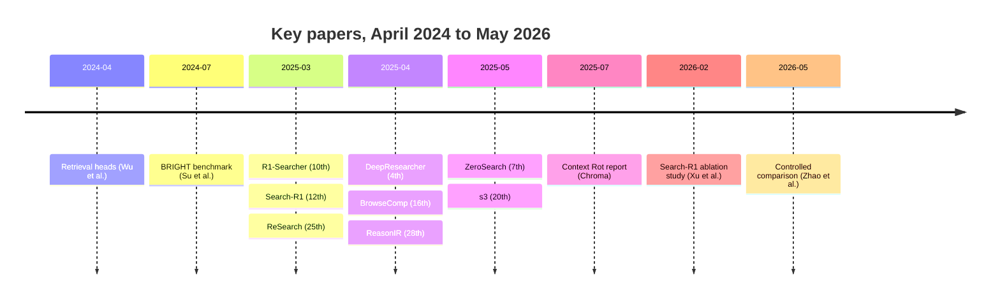
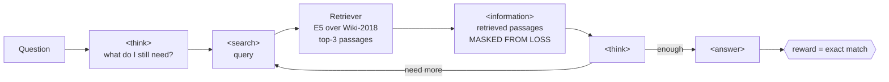
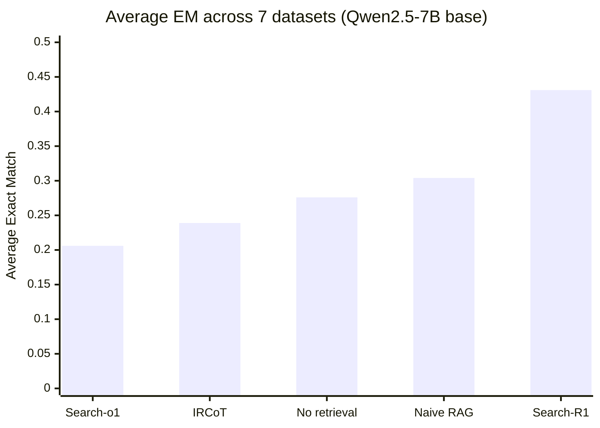
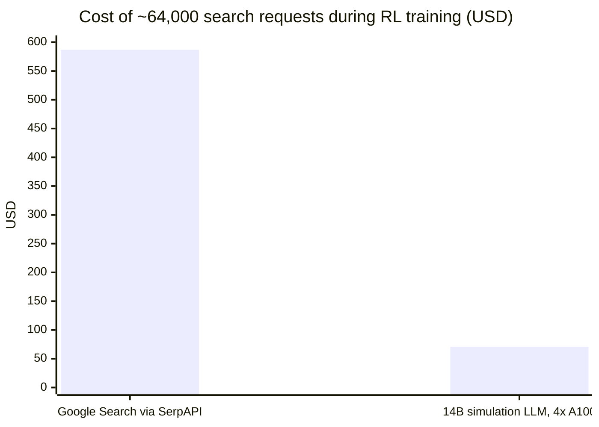

# Retrieval became a policy: what RL-trained search agents changed in 2025–2026

On 10 March 2025, a group at Renmin University posted R1-Searcher. Two days later, a group spanning UIUC, UMass Amherst, and Google Cloud AI Research posted Search-R1. The two papers had not coordinated. Both took the recipe that had just worked for DeepSeek-R1-Zero on math and code — outcome-only reinforcement learning, no process reward model, no cold-start supervised data — and pointed it at a search engine.

The result was a model that decides for itself when to search, what to type into the query box, when to search again, and when it has enough to answer. Sixteen months later, that framing has produced enough follow-up work, contradictory results, and failed reproductions to be worth a careful look.

This post covers what the mechanism is, what the numbers actually say, and where the 2026 literature has started pushing back.

## The problem the field thought it had solved

For about eighteen months, the loudest claim in applied NLP was that retrieval-augmented generation was on its way out. Context windows went from 4k to 128k to a million tokens. If the whole corpus fits in the prompt, why maintain an index?

Two lines of work made that argument harder to sustain.

The first was mechanistic. Wenhao Wu and colleagues published "Retrieval Head Mechanistically Explains Long-Context Factuality" in April 2024 (arXiv:2404.15574, later at ICLR 2025). They found that a small, sparse set of attention heads is causally responsible for copying information out of a long context. Mask those heads and needle-in-a-haystack recall collapses, with the model producing fluent wrong answers rather than admitting it lost the needle. Mask a random set of heads of the same size and nothing much happens. The heads are present across LLaMA, Yi, Qwen, and Mixtral families at 6B to 34B scale. Long-context retrieval, in other words, runs through a narrow and identifiable bottleneck rather than being diffusely distributed through the network.

The second was empirical. In July 2025, Kelly Hong, Anton Troynikov, and Jeff Huber at Chroma published a technical report titled "Context Rot," evaluating 18 models including GPT-4.1, Claude 4, Gemini 2.5, and Qwen3. Performance degraded as input length grew, on tasks simple enough that length should not have mattered. One finding was genuinely strange: models sometimes did better on a shuffled haystack than on a logically coherent document.

So the long window is real but the attention budget inside it is not free. That reframes the question. It is not whether to retrieve, but who decides what goes in the window and on what basis. In classic RAG, that decision is a fixed pipeline: embed the query, pull top-k, concatenate, generate. The March 2025 papers made it a learned policy.

## Timeline

## The mechanism

Search-R1 (Bowen Jin et al., arXiv:2503.09516) treats the search engine as part of the RL environment. A rollout is a single generation stream in which the model emits structured spans:

Three design choices carry most of the weight.

Retrieved-token masking. Passages arrive inside `<information>` tags and are excluded from the loss. The model is neither rewarded nor penalized for text it did not write. Without this, gradients flow through arbitrary retriever output and training destabilizes. R1-Searcher (Huatong Song et al., arXiv:2503.05592) arrived at the same solution independently, using `<begin_of_documents>` and `<end_of_documents>` markers.

Multi-turn interleaving. The search call is not a preprocessing step. It happens mid-reasoning, as many times as the policy decides, with each result conditioning the next query.

Minimal outcome reward. Search-R1 scores the final answer against ground truth: 1 for a correct and well-formatted answer, 0.25 if correct but wrapped in excessive answer tags, 0 otherwise. No process reward model, no learned verifier, no step-level annotation. The search strategy is left to emerge.

R1-Searcher splits this into two stages instead. Stage one rewards the model for invoking retrieval at all, teaching the interface. Stage two rewards answer correctness. Neither stage needs supervised trajectories.

## What the numbers said

Search-R1's main table uses Exact Match across seven QA datasets. NQ and HotpotQA are in-domain (the training set is NQ plus HotpotQA merged); the other five are out-of-domain. The retriever is E5 over the December 2018 Wikipedia dump, returning three passages.

| Method (Qwen2.5-7B) | NQ | TriviaQA | PopQA | HotpotQA | 2Wiki | MuSiQue | Bamboogle | Avg |
|---|---|---|---|---|---|---|---|---|
| No retrieval | 0.297 | 0.539 | 0.202 | 0.242 | 0.273 | 0.083 | 0.296 | 0.276 |
| Naive RAG | 0.349 | 0.585 | 0.392 | 0.299 | 0.235 | 0.058 | 0.208 | 0.304 |
| IRCoT | 0.224 | 0.478 | 0.301 | 0.133 | 0.149 | 0.072 | 0.224 | 0.239 |
| Search-o1 | 0.151 | 0.443 | 0.131 | 0.187 | 0.176 | 0.058 | 0.296 | 0.206 |
| Search-R1 (PPO) | 0.480 | 0.638 | 0.457 | 0.433 | 0.382 | 0.196 | 0.432 | 0.431 |

*Table 1. Exact Match on seven QA datasets, Qwen2.5-7B base. Source: Jin et al., arXiv:2503.09516v3, Table 2.*

*Figure 1. The same averages, plotted. Note that two prompting-based retrieval methods score below the no-retrieval baseline.*

Two things stand out. Naive RAG beats no-retrieval by less than three points on average, and loses outright on 2Wiki, MuSiQue, and Bamboogle — the multi-hop sets where a single top-k pull cannot get you there. And the prompting-based agentic methods, IRCoT and Search-o1, come in below the no-retrieval baseline at this model scale. Giving a 7B model a search tool and asking nicely made it worse. Training it to use the tool made it better by 12.7 EM points over naive RAG.

The 3B results are more modest: Search-R1-instruct averages 0.325 against 0.270 for naive RAG. GRPO variants land between the two, with the paper reporting that GRPO converges faster while PPO is more stable.

One bookkeeping note that matters if you cite this paper. The headline relative-improvement figure in the abstract changed across arXiv versions: 24% in v1, 26% in v2, 41% in v3 for Qwen2.5-7B. Cite the version.

## Live web or simulated web

Search-R1 and R1-Searcher both train against a frozen local corpus. Two April–May 2025 papers took that assumption in opposite directions.

DeepResearcher (Yuxiang Zheng et al., arXiv:2504.03160, EMNLP 2025 Main) trained against the live web with GRPO — real search APIs, real rate limits, real anti-crawling, real webpages that need a browsing agent to parse. The authors argue this is not an engineering detail but a requirement, and report emergent behaviors they attribute to the messiness: planning, cross-validating a claim across sources, redirecting mid-investigation, and declining to answer when nothing conclusive turns up.

| Method | Env | NQ | TriviaQA | HotpotQA | 2Wiki | MuSiQue | Bamboogle | PopQA |
|---|---|---|---|---|---|---|---|---|
| CoT | Local | 19.8 | 45.6 | 24.4 | 26.4 | — | — | — |
| CoT + RAG | Local | 42.0 | 68.9 | 37.1 | 24.4 | 10.0 | 25.4 | 46.9 |
| Search-r1-base | Local | 45.4 | 71.9 | 55.9 | 44.6 | 26.7 | 56.5 | 43.2 |
| R1-Searcher | Web | 35.4 | 73.1 | 44.8 | 59.4 | 22.8 | 64.8 | 42.7 |
| DeepResearcher | Web | 39.6 | 78.4 | 52.8 | 59.7 | 27.1 | 71.0 | 48.5 |

*Table 2. Word-level F1. First four columns in-domain, last three out-of-domain. Source: Zheng et al., arXiv:2504.03160v2, Tables 1–2. These are F1 on a 0–100 scale and are not comparable to the Exact Match figures in Table 1, even for the same datasets.*

DeepResearcher wins every out-of-domain column and loses in-domain NQ and HotpotQA to the local-corpus Search-R1, which the authors attribute to its direct Wikipedia access — the in-domain questions were built from Wikipedia in the first place. The abstract claims up to 28.9 points over prompt-engineering baselines and up to 7.2 over RAG-based RL agents.

ZeroSearch (Hao Sun et al., Alibaba Tongyi Lab, arXiv:2505.04588) went the other way and argued you do not need a search engine at all. A light supervised fine-tune turns an LLM into a document generator that produces plausible passages, both useful and deliberately noisy, on a curriculum that degrades document quality as training proceeds. The training signal comes from a simulator, not a crawler.

The cost argument is the one that landed. With batch size 64, 5 rollouts, and 200 steps — about 64,000 search requests, roughly 12 hours on Qwen2.5-7B — the paper prices Google Search via SerpAPI at $586.70 and a 14B simulator on four A100s at $70.80.

*Figure 2. Source: Sun et al., arXiv:2505.04588, Appendix D. AWS and SerpAPI pricing as of mid-2025; both have moved since.*

On performance, ZeroSearch reports a 7B simulator matching Google Search and a 14B one beating it: averaged scores of 33.06 and 33.97 against 32.47.

So one well-resourced 2025 paper says live-web training is a fundamental requirement and another says a fine-tuned 14B model substitutes for Google. They are not testing quite the same thing — DeepResearcher's claim is about generalization to open-web conditions, ZeroSearch's is about training-signal quality on standard QA — but the disagreement is real and nobody has adjudicated it cleanly.

## How much of this training is necessary

s3 (Pengcheng Jiang et al., arXiv:2505.14146, EMNLP 2025 Main) attacked a different assumption: that you need to train the whole model. It trains only a searcher and leaves the generator frozen, which makes it compatible with a proprietary generator you cannot fine-tune. The reward is Gain Beyond RAG — how much the retrieved set improves generation accuracy relative to what naive RAG would have produced.

| System | Training examples | Wall-clock training |
|---|---|---|
| Search-R1 | 170,000 | 3,780 min |
| DeepRetrieval | 70,000 | — |
| s3 | 2,400 | 114 min |

*Table 3. Source: Jiang et al., arXiv:2505.14146. The wall-clock comparison is roughly 33×. s3 also reports cutting context tokens by up to 4.2× through document selection.*

The sharper contribution is a critique of the reward itself. The s3 authors report that generation accuracy agrees with human judgment on 96.4% of samples while exact match agrees on 15.8%. If that holds, every EM-rewarded system in this literature is optimizing a signal that disagrees with humans most of the time — the model gets zero for saying "Barack Obama" when the gold string is "Obama."

## The retriever did not get the memo

While the generator side was learning to search, the retriever side was discovering it could not handle reasoning-intensive queries at all.

BRIGHT (Hongjin Su et al., arXiv:2407.12883) is 1,384 real-world queries where relevance requires multi-step inference rather than lexical or semantic overlap. The headline result is a gap, not a score: SFR-Embedding-Mistral, then leading the MTEB leaderboard at 59.0 nDCG@10, scores 18.3 on BRIGHT. The paper also shows that generating explicit reasoning about the query before retrieving helps by up to 12.2 points — BM25 goes from 14.8 to 26.5 average nDCG@10 with GPT-4-written reasoning steps. A bag-of-words baseline plus a reasoning step beats a state-of-the-art dense retriever.

| System | BRIGHT nDCG@10 |
|---|---|
| SFR-Embedding-Mistral | 18.3 |
| BM25 | 14.8 |
| BM25 + GPT-4 query reasoning | 26.5 |
| ReasonIR-8B | 29.9 |
| ReasonIR-8B + reranker | 36.9 |
| RaDeR (gte-Qwen2-7B, MATH queries) + BM25 hybrid, Qwen2.5-32B reranker | 39.2 |

*Table 4. Sources: Su et al., arXiv:2407.12883; Shao et al., arXiv:2504.20595; RaDeR, arXiv:2505.18405. Note the reranked and hybrid entries are not like-for-like with the single-retriever ones.*

ReasonIR-8B (Rulin Shao et al., Meta FAIR, arXiv:2504.20595) is described by its authors as the first retriever trained specifically for general reasoning tasks. Beyond the BRIGHT numbers, it reports downstream gains of 6.4% on MMLU and 22.6% on GPQA relative to a closed-book baseline, beating both other retrievers and search engines.

This is the part of the story most often skipped. A search agent trained with RL still calls a retriever, and if that retriever is a similarity function, the agent's learned queries are constrained by what similarity can find.

## The 2026 correction

The most useful paper in this literature is not a method paper. In May 2026, Yibo Zhao, Zichen Ding, Jiayi Wu, Zun Wang, and Xiang Li (East China Normal University and Shanghai AI Laboratory) published a controlled comparison (arXiv:2605.27881) that reimplemented four credit-assignment schemes — Search-R1, GiGPO, IGPO, and Tree-GRPO — inside one GRPO objective, one codebase, one training set of 9,000 examples drawn from HotpotQA, MuSiQue, and 2WikiMultihopQA.

Their first finding concerns the corpus everyone uses. They compared the annotated supporting documents from those three datasets against the Wikipedia 2018 dump and found 295,331 supporting documents missing. Of their 9,000 training instances, 3,321 ask questions whose gold evidence is simply not in the index.

You would expect those to produce no gradient — every rollout fails, the group advantage is zero. That is not what happened. Under Search-R1, the model answered 1,697 of the 3,321 unanswerable questions correctly at least once, and for 831 of them every rollout in the group was correct. Roughly 10% of the training set was generating gradient from parametric memory rather than from retrieval. GiGPO, IGPO, and Tree-GRPO showed 890, 698, and 859 such groups. The problem is systematic, not an artifact of one algorithm.

The authors built a corrected corpus (Wiki-fixed) by adding the missing documents and retrained everything on both.

| Train env → Test env | Search-R1 | GiGPO | IGPO | Tree-GRPO |
|---|---|---|---|---|
| Wiki-fixed → Wiki-fixed | 49.49 | 47.23 | 49.12 | 44.63 |
| Wiki-18 → Wiki-fixed | 43.69 | 44.11 | 43.70 | 42.57 |
| Wiki-fixed → Wiki-18 | 39.89 | 37.76 | 40.54 | 35.60 |
| Wiki-18 → Wiki-18 | 36.15 | 36.86 | 36.44 | 35.76 |

*Table 5. Average EM across five benchmarks, Qwen3-8B, Hermes tool-call format. Source: Zhao et al., arXiv:2605.27881v2, Table 7.*

Fixing the corpus is worth 2 to 6 EM points. That exceeds the spread between the four training algorithms. And in the bottom row — the setting most of the field has been running in — the four methods converge to within 0.7 points of each other, while method rankings shift: Search-R1 is first under Wiki-fixed and third under Wiki-18. When the authors excluded the unanswerable questions and retrained, the corpus gap collapsed to under 1.1 points for every method, which confirms the missing documents were the cause.

The process evaluation is more uncomfortable. The authors took 2,000 held-out examples, decomposed each trained agent's trajectories into steps, and at each step asked the untrained base model to write the next query given the same history. Then they compared what each retrieved.

| | Search-R1 | GiGPO | IGPO | Tree-GRPO |
|---|---|---|---|---|
| Recall, trained | 37.23 | 49.58 | 43.09 | 39.76 |
| Recall, untrained | 41.73 | 40.00 | 43.62 | 42.55 |
| Overlap, trained | 4.20 | 10.48 | 40.15 | 26.51 |
| Overlap, untrained | 7.87 | 7.64 | 36.02 | 8.66 |

*Table 6. Recall of supporting documents (higher is better) and overlap with previously retrieved documents (lower is better). Source: Zhao et al., arXiv:2605.27881v2, Table 3.*

Three of four methods make the model a worse query writer than the untrained baseline it started from. Search-R1 drops 4.50 points of recall, Tree-GRPO 2.79, IGPO 0.53; only GiGPO improves, by nearly ten. Search-R1's compensation is visible in the overlap row: it retrieves less redundantly, exploring more directions with weaker individual queries. The agents got better at answering questions without getting better at searching.

## What is still unsettled

Reproduction. In February 2026, Yinuo Xu and colleagues (arXiv:2602.19526) ran a systematic ablation of Search-R1's prompt template, reward function, and policy optimizer. They report being unable to fully match the published numbers despite trying, and note that other independent reproductions have hit the same wall. Their own findings cut against several defaults: a "fast thinking" template that has the policy emit search and answer decisions directly beats the slow-thinking template used in prior work; an F1-based reward collapses through answer avoidance unless paired with action-level penalties; REINFORCE outperforms PPO while calling search less; GRPO is the least stable of the three. Their Search-R1++ baseline reaches 0.442 from 0.403 on Qwen2.5-7B and 0.331 from 0.289 on Qwen2.5-3B.

They also report that longer reasoning traces and more retrieved information do not reliably produce better answers. More search is not the win condition.

Benchmark headroom. Zhao et al. varied the search budget from 4 to 32 turns during both training and evaluation. No method gained more than 0.3 points from being allowed a larger evaluation budget than it trained with, and three of four got worse as the training budget grew — comparing 4-turn training and evaluation against 32-turn, Search-R1, GiGPO, and IGPO all score about five points higher in the 4-turn setting. Their explanation is blunt: the standard multi-hop datasets can almost always be solved within eight searches, so there is nothing at the far end of the budget to learn.

That matters because the whole literature runs on HotpotQA, 2Wiki, MuSiQue, and Bamboogle. BrowseComp (Jason Wei et al., OpenAI, arXiv:2504.12516) gives a sense of what happens above that ceiling. Across its 1,266 problems, turning on browsing for GPT-4o moved accuracy from 0.6% to 1.9%. The specially trained Deep Research system reached 51.5%. Tool access bought almost nothing; training on the task bought everything. If you want the strongest available argument for the agentic-RL thesis, it is that gap, not the two-to-five-point deltas on Wikipedia QA.

Cost claims. The dollar figures in this post come from ZeroSearch's appendix and reflect mid-2025 SerpAPI and AWS pricing. Zhao et al. note in their limitations that web-search API costs prevented them from running their roughly 100-experiment suite under web retrieval at all, so their conclusions hold only for local corpora. The industry claims about RAG being one or two orders of magnitude cheaper than long context circulate mostly through vendor blogs and have not been independently replicated.

## Where that leaves it

The strong version of the "RAG is dead" claim did not survive contact with the retrieval-head and context-rot results. What replaced it is not a return to the old pipeline. It is retrieval as a learned policy: the model decides what enters its context, trained on whether the answer came out right.

The evidence that this beats a fixed pipeline is solid at the level of averages and shaky at the level of mechanism. Search-R1 clears naive RAG by 12.7 EM points, and prompting alone makes things worse, so something is being learned. But a controlled 2026 study finds the corpus matters more than the algorithm, that roughly a tenth of the standard training signal may come from memorization rather than search, and that most of these methods make the model a worse query writer than the base model it started from. Those can all be true at once if what the RL mostly teaches is when to stop and how to compose evidence, rather than how to search.

Two things would settle it. A clean reproduction on a corrected corpus, with the memorization-contaminated instances excluded, would show how much of the reported gain survives. And results on a benchmark with genuine long-horizon depth — BrowseComp rather than HotpotQA — would show whether these training recipes scale past the eight-search ceiling or were fitted to it.

---

## References

- Jin, Bowen, et al. "Search-R1: Training LLMs to Reason and Leverage Search Engines with Reinforcement Learning." arXiv:2503.09516, 12 March 2025.
- Song, Huatong, et al. "R1-Searcher: Incentivizing the Search Capability in LLMs via Reinforcement Learning." arXiv:2503.05592, 10 March 2025.
- Chen, Mingyang, et al. "ReSearch: Learning to Reason with Search for LLMs via Reinforcement Learning." arXiv:2503.19470, 25 March 2025.
- Zheng, Yuxiang, et al. "DeepResearcher: Scaling Deep Research via Reinforcement Learning in Real-world Environments." arXiv:2504.03160, 4 April 2025. EMNLP 2025 Main.
- Sun, Hao, et al. "ZeroSearch: Incentivize the Search Capability of LLMs without Searching." arXiv:2505.04588, 7 May 2025.
- Jiang, Pengcheng, et al. "s3: You Don't Need That Much Data to Train a Search Agent via RL." arXiv:2505.14146, 20 May 2025. EMNLP 2025 Main.
- Su, Hongjin, et al. "BRIGHT: A Realistic and Challenging Benchmark for Reasoning-Intensive Retrieval." arXiv:2407.12883, July 2024.
- Shao, Rulin, et al. "ReasonIR: Training Retrievers for Reasoning Tasks." arXiv:2504.20595, 28 April 2025.
- "RaDeR: Reasoning-aware Dense Retrieval Models." arXiv:2505.18405, May 2025.
- Wu, Wenhao, et al. "Retrieval Head Mechanistically Explains Long-Context Factuality." arXiv:2404.15574, April 2024. ICLR 2025.
- Wei, Jason, et al. "BrowseComp: A Simple Yet Challenging Benchmark for Browsing Agents." arXiv:2504.12516, April 2025.
- Hong, Kelly, Anton Troynikov, and Jeff Huber. "Context Rot: How Increasing Input Tokens Impacts LLM Performance." Chroma technical report, 14 July 2025.
- Xu, Yinuo, Shuo Lu, Jianjie Cheng, Meng Wang, Qianlong Xie, Xingxing Wang, Ran He, and Jian Liang. "How to Train Your Deep Research Agent? Prompt, Reward, and Policy Optimization in Search-R1." arXiv:2602.19526, 23 February 2026.
- Zhao, Yibo, Zichen Ding, Jiayi Wu, Zun Wang, and Xiang Li. "Retrieval, Reward, and Training Protocols: What Matters in Training Search Agents?" arXiv:2605.27881, 27 May 2026.
