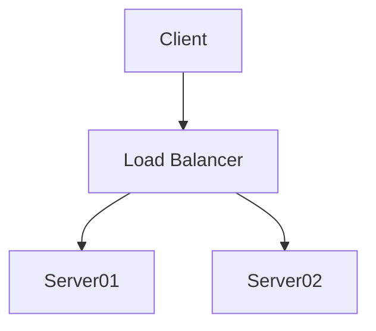

<pre class="mermaid">
{`
graph TD
    A[Client] --> B[Load Balancer]
    B --> C[Server01]
    B --> D[Server02]
`}
</pre>

```mermaid
graph TD
    A[Client] --> B[Load Balancer]
    B --> C[Server01]
    B --> D[Server02]
```