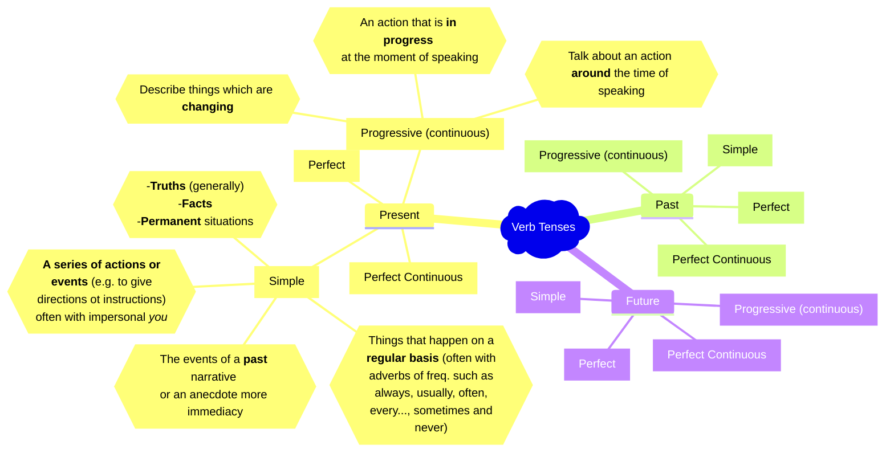

```mermaid
---
title: Verb Tenses
config:
    theme: default
---
mindmap
    root)Verb Tenses)
        Present
            Simple[Simple]
                1{{"`-**Truths** (generally)
                        -**Facts**
                        -**Permanent** situations`"}}
                2{{"`Things that happen on a
                        **regular basis** (often with 
                        adverbs of freq. such as 
                        always, usually, often, 
                        every..., sometimes and 
                        never)`"}}
                3{{"`**A series of actions or 
                        events** (e.g. to give 
                        directions ot instructions) 
                        often with impersonal *you*`"}}
                4{{"`The events of a **past** narrative 
                    or an anecdote more immediacy`"}}
            Progressive["Progressive (continuous)"]
                5{{"`An action that is **in progress** 
                    at the moment of speaking`"}}
                6{{"`Describe things which are **changing**`"}}
                7{{"`Talk about an action **around** the time of speaking`"}}
            Perfect[Perfect]
            PerfectContinuous["Perfect Continuous"]
        Past
            Simple[Simple]
            Progressive["Progressive (continuous)"]
            :::text-xl text-purple-500
            Perfect[Perfect]
            PerfectContinuous["Perfect Continuous"]
        Future
            Simple[Simple]
            Progressive["Progressive (continuous)"]
            Perfect[Perfect]
            PerfectContinuous["Perfect Continuous"]
```