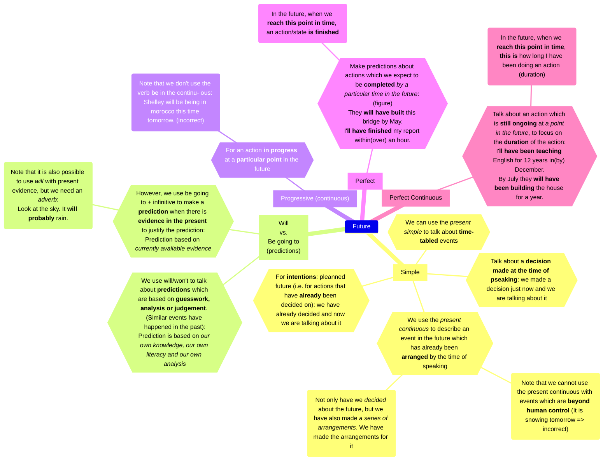

<pre class="mermaid bg-white flex justify-center">
---
title: Future Tenses
config:
    theme: default
---
mindmap
    Future
        Simple[Simple]
            1{{"`Talk about a __decision made at the time of pseaking__: we made a decision just now and we are talking about it`"}}
            2{{"`For __intentions__: pleanned future (i.e. for actions that have __already__ been decided on): we have already decided and now we are talking about it`"}}
            3{{"`We use the _present continuous_ to describe an event in the future which has already been __arranged__ by the time of speaking`"}}
                des1("`Note that we cannot use the present continuous with events which are __beyond human control__ (It is snowing tomorrow => incorrect)`")
                des2("`Not only have we _decided_ about the future, but we have also made _a series of arrangements_. We have made the arrangements for it`")
            4{{"`We can use the _present simple_ to talk about __time-tabled__ events`"}}
        Willgoing["`Will vs. Be going to (predictions)`"]
            5{{"`We use will/won't to talk about __predictions__ which are based on __guesswork, analysis or judgement__. (Similar events have happened in the past): Prediction is based on _our own knowledge, our own literacy and our own analysis_`"}}
            6{{"`However, we use be going to + infinitive to make a __prediction__ when there is __evidence in the present__ to justify the prediction: Prediction based on _currently available evidence_`"}}
                des3("`Note that it is also possible to use _will_ with present evidence, but we need an _adverb_: Look at the sky. It __will probably__ rain.`")
        Progressive["Progressive (continuous)"]
            7{{"`For an action __in progress__ at a __particular point__ in the future`"}}
                des4("`Note that we don't use the verb __be__ in the continu- ous: Shelley will be being in morocco this time tomorrow. (incorrect)`")
        Perfect[Perfect]
            8{{"`Make predictions about actions which we expect to be __completed__ _by a particular time in the future_: (figure) They __will have built__ this bridge by May. I'__ll have finished__ my report within(over) an hour.`"}}
                des5("`In the future, when we __reach this point in time__, an action/state __is finished__`")
        PerfectContinuous["Perfect Continuous"]
            9{{"`Talk about an action which is __still ongoing__ at _a point in the future_, to focus on the __duration__ of the action: I'__ll have been teaching__ English for 12 years in(by) December. By July they __will have been building__ the house for a year.`"}}
                des6("`In the future, when we __reach this point in time__, __this is__ how long I have been doing an action (duration)`")
</pre>

