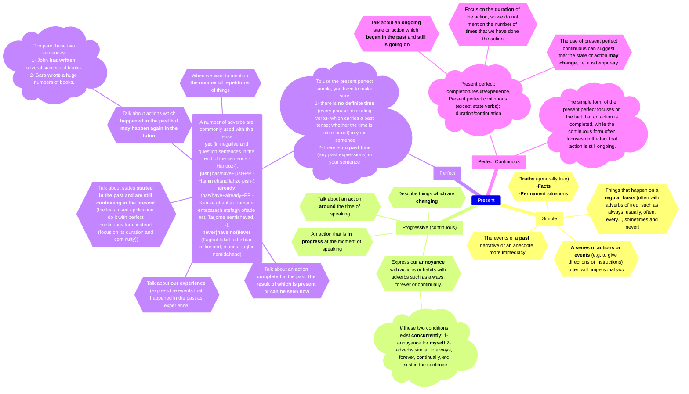

<pre class="mermaid bg-white flex justify-center">
{`
---
title: Present Tenses
config:
    theme: default
---
mindmap
    Present
        Simple[Simple]
            1{{"`-**Truths** (generally true) -**Facts** -**Permanent** situations`"}}
            2{{"`Things that happen on a **regular basis** (often with adverbs of freq. such as always, usually, often, every..., sometimes and never)`"}}
            3{{"`**A series of actions or events** (e.g. to give directions ot instructions) often with impersonal *you*`"}}
            4{{"`The events of a **past** narrative or an anecdote more immediacy`"}}
        Progressive["Progressive (continuous)"]
            5{{"`An action that is **in progress** at the moment of speaking`"}}
            6{{"`Describe things which are **changing**`"}}
            7{{"`Talk about an action **around** the time of speaking`"}}
            8{{"`Express our **annoyance** with actions or habits with adverbs such as always, forever or continually.`"}}
                d1)"`*If* these two conditions exist **concurrently**: 1- annoyance for **myself** 2- adverbs similar to always, forever, continually, etc exist in the sentence`"(
        Perfect[Perfect]
            9)"`To use the present perfect simple, you have to make sure: 1- there is __no definite time__ (every phrase -excluding verbs- which carries a past tense; whether the time is clear or not) in your sentence 2- there is __no past time__ (any past expressions) in your sentence `"(
                10("`A number of adverbs are commonly used with this tense: __yet__ (in negative and question sentences in the end of the sentence -Hanooz-), __just__ (has/have+just+PP -Hamin chand lahze pish-), __already__ (has/have+already+PP -Kari ke ghabl az zamane entezarash etefagh oftade ast, Tarjome nemishavad, -), __never(have not)/ever__ (Faghat takid ra bishtar mikonand, mani ra taghir nemidahand)`")
                    11{{"`Talk about states __started in the past and are still continuing in the present__ (the least used application, do it with perfect continuous form instead (focus on its duration and continuity))`"}}
                    12{{"`Talk about actions which __happened in the past but may happen again in the future__`"}}
                        ex1)"`Compare these two sentences: 1- John __has written__ several successful books. 2- Sara __wrote__ a huge numbers of books.`"(
                    13{{"`Talk about __our experience__ (express the events that happened in the past as experience)`"}}
                    14{{"`Talk about an action __completed__ in the past, __the result of which is present__ or __can be seen now__`"}}
                    15{{"`When we want to mention __the number of repetitions__ of things`"}}
        PerfectContinuous["Perfect Continuous"]
            19)"`Present perfect: completion/result/experience, Present perfect continuous (except state verbs): duration/continuation`"(
                16{{"`Talk about an __ongoing__ state or action which __began in the past__ and __still is going on__`"}}
                17{{"`Focus on the __duration__ of the action, so we do not mention the number of times that we have done the action`"}}
                18{{"`The use of present perfect continuous can suggest that the state or action __may change__, i.e. it is temporary.`"}}
            20)"`The simple form of the present perfect focuses on the fact that an action is completed, while the continuous form often focuses on the fact that action is still ongoing.`"(
`}
</pre>

