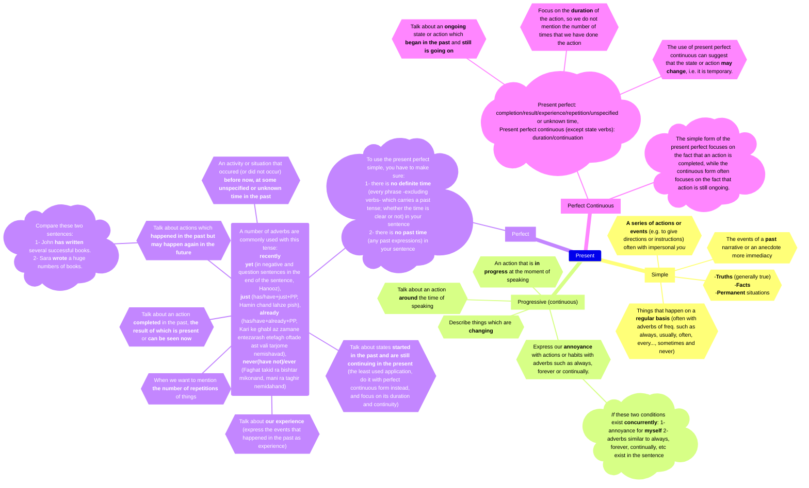

Download datasets from [here](https://raw.githubusercontent.com/KiarashS/BlogFiles/master/Datasets/IntoStatistics-Datasets.zip).

# Introduction

Electrocardiogram (ECG) data—captured from wearable sensors—provides rich physiological insights. In this tutorial, we explore how to:

- Load ECG time-series data
- Preprocess and clean the signal
- Detect heartbeats (R‑peaks)
- Compute heart rate
- Visually analyze ECG traces in Python using `Matplotlib`

